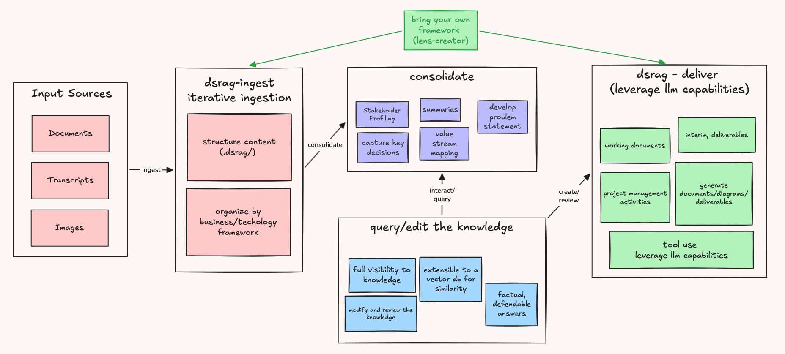

# DSRAG

**Turn interviews and documents into structured, citable knowledge bases — automatically.**

DSRAG (Document-Source Retrieval Augmented Generation) processes unstructured transcripts and documents through multiple analytical lenses in parallel, extracting stakeholder profiles, problems, value streams, and meeting intelligence — all with line-level source citations you can trace back and verify.



## The Problem

Traditional RAG goes straight from documents to similarity matching — embed chunks, search a vector database, get answers. But you can't see what was extracted, can't trace answers to who said what, and the knowledge lives in an opaque index. For consultants and analysts whose work depends on traceability and structured deliverables, this is limiting. DSRAG fills this gap as a **structured, inspectable knowledge layer** between your raw sources and your deliverables.

See [Design Philosophy](docs/design.md) for the full comparison.

## What DSRAG Does

| Lens | What It Extracts | Output |
|------|-----------------|--------|
| **Stakeholder Profiling** | People, roles, relationships, pain points | Individual profiles + relationship map |
| **Problem Extraction** | Issues, gaps, failures by type and severity | Problem index + category/priority views |
| **Value Stream Mapping** | Processes, workflows, waste, improvements | Per-source VSM analysis |
| **Transcript Summary** | Executive summary, decisions, action items | Per-source meeting intelligence |
| **Document Analyzer** | Document-specific analysis (SOWs, specs) | Structured document breakdown |

## Quick Start

Prerequisites: [Claude Code CLI](https://docs.anthropic.com/en/docs/claude-code) installed.

```bash
# 1. Copy dsrag/ into your project
cp -r dsrag/ /path/to/your-project/

# 2. Initialize a project
/dsrag-init-project --project-id my-project

# 3. Add sources and ingest
cp interviews/*.txt my-project/transcripts/
/dsrag-ingest --project-id my-project
```

See [Getting Started](docs/getting-started.md) for the full guide.

## Documentation

| Document | Description |
|----------|-------------|
| [Design Philosophy](docs/design.md) | Why DSRAG exists — the problem, the approach, when to use it |
| [Getting Started](docs/getting-started.md) | Installation, setup, and first project walkthrough |
| [Architecture](docs/architecture.md) | System design, data flow, and components |
| [Lenses](docs/features/lenses.md) | How extraction lenses work |
| [Consolidation](docs/features/consolidation.md) | Cross-source synthesis and aggregation |
| [Delivery](docs/features/delivery.md) | Template-based deliverable generation |
| [Knowledge Graph](docs/features/knowledge-graph.md) | Entity relationship visualization |
| [Content Guide](docs/content-guide.md) | Format specs for contributing lenses and templates |
| [Extending DSRAG](docs/extending-dsrag.md) | Developer guide for adding new lenses and templates |

## Contributing

DSRAG welcomes contributions — new extraction lenses, delivery templates, bug fixes, and documentation improvements. We use an issue-first workflow: open an issue to discuss your idea, then submit a PR.

See [Contributing](CONTRIBUTING.md) and [Content Guide](docs/content-guide.md).

## License

DSRAG is source-available under the [Business Source License 1.1](LICENSE). You may use it for non-production purposes (personal, educational, research, evaluation). Production use requires a commercial license. On 2030-03-13, it converts to Apache 2.0.

## Version

**Current:** 4.3
