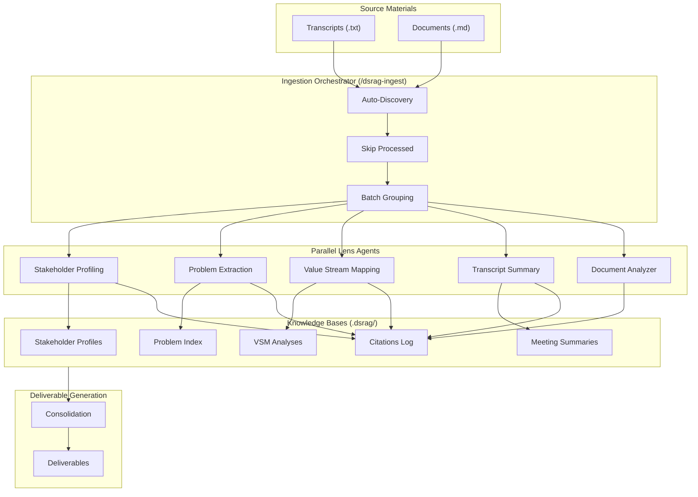
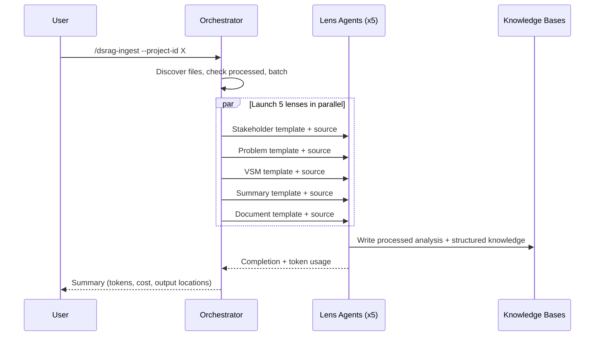

# Architecture

## Overview

DSRAG transforms unstructured knowledge (transcripts, documents) into structured, queryable knowledge bases with full source traceability. It operates as a set of Claude Code skills and internal agent templates.

Key principles:

1. **Source Truth** -- every fact cites source file and line number
2. **Multi-Perspective** -- same source analyzed through specialized lenses
3. **Upsert Logic** -- knowledge grows incrementally, never loses data
4. **Parallelism** -- process multiple lenses and sources concurrently
5. **Incremental** -- skip already-processed sources automatically

## System Diagram



## Components

### User-Facing Skills (9)

| Skill | Purpose |
|-------|---------|
| `dsrag-init-project` | Initialize project structure |
| `dsrag-ingest` | Discover, batch, and process sources through all lenses |
| `dsrag-consolidate` | Aggregate knowledge into versioned reference documents |
| `dsrag-deliver` | Generate deliverables from consolidated knowledge |
| `dsrag-kg` | Knowledge graph visualization |
| `dsrag-create-lens` | Guided custom lens creation |
| `dsrag-pm-update` | PM status reports |
| `dsrag-visualize` | Visual validation of consolidated knowledge |
| `dsrag-reset-project` | Archive and reset project data |

### Internal Agent Templates (5 Lenses)

| Agent | Extracts |
|-------|----------|
| `stakeholder-profiling` | People, roles, relationships, pain points |
| `problem-extraction` | Issues, gaps, categorized by type and severity |
| `value-stream-mapping` | Processes, workflows, waste, improvements |
| `transcript-summary` | Executive summary, decisions, action items |
| `document-analyzer` | Document-specific analysis (SOWs, specs) |

Agents are NOT user-facing -- they are read at runtime by the `/dsrag-ingest` orchestrator and passed as prompts to Task agents.

### Utility Scripts

| Script | Purpose |
|--------|---------|
| `dsrag_citation_manager.py` | CRUD operations on citations.jsonl |
| `dsrag_token_tracker.py` | Token usage and cost calculation |
| `dsrag_conflict_detector.py` | Detect contradictions between sources |
| `dsrag_init_project.py` | Project initialization logic |
| `dsrag_template_engine.py` | Deliverable template processing |
| `dsrag_versioning.py` | Semantic version management |

## Data Flow



## Two-Stage Extraction

Each lens follows two stages:

**Stage 1: Processed Analysis** (intermediate)
- Raw observations, notes, quotes
- File: `.dsrag/[project]/processed/[type]/[lens]_[filename].md`

**Stage 2: Structured Knowledge** (final, append-only)
- Clean, queryable format with citations
- Files: `.dsrag/[project]/knowledge/[domain]/`

This separates analysis (messy) from knowledge (clean).

## Storage Architecture

```
.claude/                        # Tool code (portable)
├── agents/dsrag/              # Internal agent templates
├── skills/                    # User-facing skills
└── scripts/dsrag/             # Utility scripts

.dsrag/                        # Project data (project-specific)
└── [project-id]/
    ├── config.json
    ├── knowledge/             # Structured knowledge
    └── processed/             # Intermediate analysis

[project-id]/                  # Source materials (user data)
├── transcripts/
└── documents/
```

Boundary rules:
- `.claude/` = tool code -- copy to other projects
- `.dsrag/` = processed data -- project-specific
- `[project-id]/` = source files -- user's raw data

## Design Decisions

- **Skills for orchestration** -- only Claude can invoke the Task tool for parallelism
- **Upsert not replace** -- knowledge accumulates, never loses data
- **JSONL for citations** -- append-safe, greppable, no dependencies
- **Markdown for knowledge** -- human-readable, version-controllable
- **Line-level citations** -- verifiable, precise, builds trust
