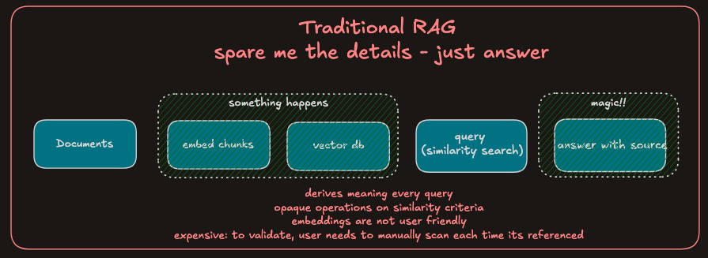
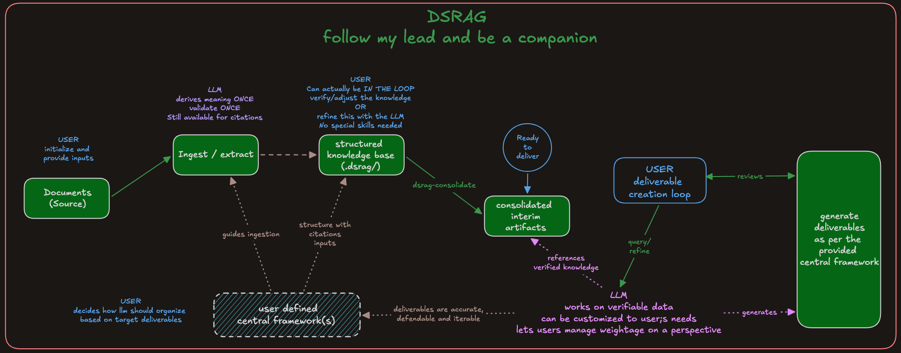

# Design Philosophy

DSRAG exists because traditional RAG approaches skip a critical step — building a structured, inspectable knowledge base between raw sources and generated answers. Instead of embedding text into opaque vectors and hoping similarity search surfaces the right context, DSRAG extracts structured facts, profiles, and relationships with full source traceability, then assembles them into deliverables you can audit end-to-end.

## The Problem

Traditional RAG follows a straightforward pipeline: embed document chunks, store them in a vector database, run similarity search at query time, and generate an answer from the retrieved context. This works well for ad-hoc Q&A, but it leaves significant gaps when your work depends on accuracy, traceability, and structured analysis.

- **No visibility into the knowledge.** After processing 10 stakeholder interviews, what do you actually know? Vector embeddings are numerical arrays — they don't tell you which stakeholders were mentioned, what problems surfaced repeatedly, or how processes connect. You can query the system, but you can't inspect the knowledge itself.

- **No traceability.** When a deliverable states "the CRM is a bottleneck," you need the exact quote, the speaker who said it, and the line number in the original transcript. Vector-based retrieval gives you approximate chunk matches, not precise citations.

- **No structure.** Interviews contain stakeholders, problems, processes, decisions, and action items — all interleaved in a single conversation. Embedding treats them as undifferentiated text, losing the analytical structure that makes the content useful.

- **No intermediate step.** You go from raw documents directly to generated answers with nothing in between. There is no artifact you can review, correct, or build upon incrementally. If the generated answer is wrong, you start over.

## How DSRAG Solves It

DSRAG introduces a structured knowledge layer between your raw sources and your deliverables. Instead of embedding and retrieving, it extracts, structures, and assembles.

### Flow Comparison

Traditional RAG:
```
Documents -> Embed Chunks -> Vector DB -> Similarity Search -> Generate Answer
                                  (opaque)
```

DSRAG:
```
Documents -> Multi-Lens Extraction -> Structured Knowledge Base -> Deliverables
               (transparent)              (inspectable)            (cited)
```

### Visual Comparison





### Feature Comparison

| | Traditional RAG | DSRAG |
|---|---|---|
| **What you get** | Generated answers to queries | Structured knowledge base + cited deliverables |
| **Visibility** | Opaque embeddings; you see results, not knowledge | Markdown and JSONL files you can open, read, and edit |
| **Citations** | Approximate chunk references | Line-level citations to source file, speaker, and line number |
| **Knowledge structure** | Flat chunks indexed by similarity | Typed extractions: stakeholders, problems, value streams, decisions |
| **Perspective** | Single embedding per chunk | Multiple analytical lenses applied to the same source in parallel |
| **Intermediate artifacts** | None — raw documents to answers | Extraction files, consolidated indices, relationship maps |
| **Infrastructure** | Vector database, embedding model, retrieval pipeline | File system only — Markdown and JSONL, no external dependencies |
| **Processing** | Embed once, query many times | Extract once through lenses, then assemble deliverables on demand |
| **Extensibility** | Swap embedding models, retrieval algorithms, reranking strategies | Add custom extraction lenses and delivery templates |

## When to Use DSRAG

**Use DSRAG when:**

- You need to see and inspect what was extracted before producing deliverables
- Accuracy and traceability are essential — consulting engagements, compliance reviews, audits
- You are producing structured deliverables from interview or document data
- You want a knowledge base that grows incrementally as new sources are added
- You have a bounded set of sources (under 100 documents)

**Use traditional vector-based RAG when:**

- You need ad-hoc Q&A over thousands of documents
- You require real-time retrieval over a large, continuously changing corpus
- Source structure does not matter for your use case
- You are building a chatbot or search interface

**They complement each other.** DSRAG and traditional RAG are not mutually exclusive. You can use DSRAG to build a structured, inspectable knowledge base from your core sources — stakeholder interviews, SOWs, requirements documents — and use vector-based RAG alongside it for broader corpus search. The structured extractions from DSRAG can even feed into a vector index if you need both precise analytical deliverables and open-ended retrieval.

## Trade-offs

| | DSRAG | Traditional RAG |
|---|---|---|
| **Strengths** | Full visibility into extracted knowledge; line-level citations; analytical structure across multiple lenses; deliverable-ready output | Scales to thousands of documents; real-time retrieval; minimal upfront processing |
| **Costs** | Token-intensive upfront extraction (~$0.40-0.64 per transcript); best suited for bounded document sets | Embedding costs scale with corpus size; ongoing retrieval and generation costs per query |
| **Extensibility** | Add custom extraction lenses and delivery templates to match your domain | Change embedding models, retrieval algorithms, reranking strategies |

## Key Principles

1. **Source Truth** — every extracted fact cites the source file and line number, so you can always trace back to the original
2. **Multi-Perspective** — the same source is analyzed through specialized lenses (stakeholder, problem, value stream, summary), each producing its own structured output
3. **Upsert Logic** — knowledge grows incrementally; re-processing a source updates existing extractions without losing data from other sources
4. **File-Based** — all knowledge is stored as Markdown and JSONL files on disk, with no external database dependencies
5. **Incremental** — already-processed sources are detected and skipped automatically, so you only pay for new content
