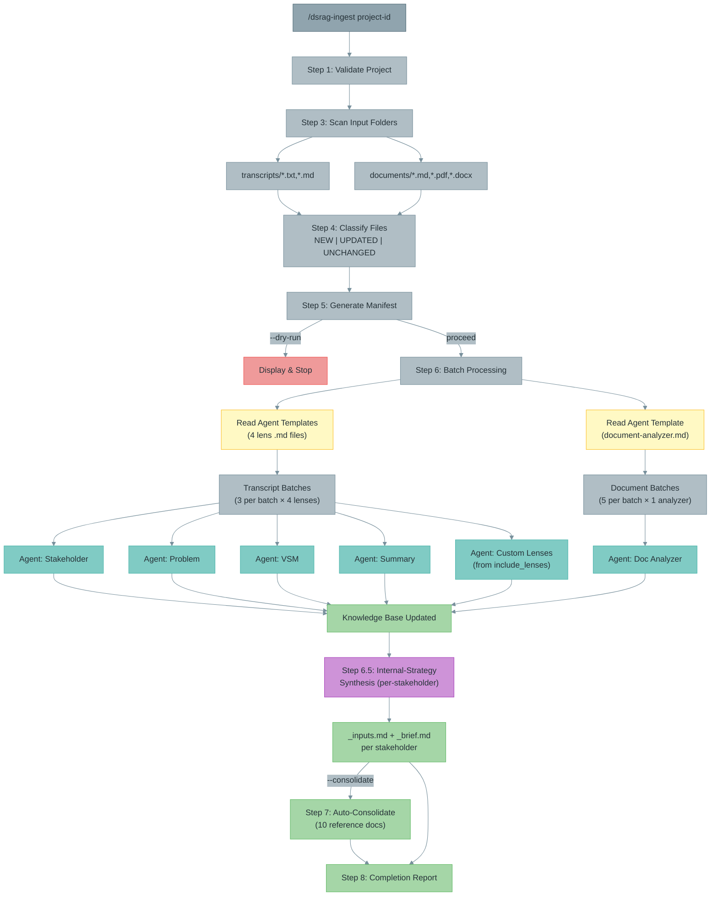

# DSRAG Ingest

Single command to discover, classify, and process all new or updated source materials in a project.

## When to Use

- **Daily knowledge update:** "process everything new since last run"
- **After adding files to input folders:** Drop files in `transcripts/` or `documents/`, then run this
- **First stage of the pipeline:** INGEST → CONSOLIDATE → DELIVER
- **Replaces manual invocation of:** `dsrag-add-transcript` (deprecated), `dsrag-add-document` (deprecated), `dsrag-process-folder` (deprecated)

## Usage

```bash
/dsrag-ingest [project-id]                    # Ingest all new/updated files
/dsrag-ingest [project-id] --consolidate      # Ingest + consolidate
/dsrag-ingest [project-id] --dry-run          # Preview manifest only
/dsrag-ingest [project-id] --force            # Re-process all files
```

**Parameters:**
- `project_id` (required): Project identifier (e.g., `my-project`)
- `--consolidate` (optional): Auto-trigger `/dsrag-consolidate` after all ingestion completes
- `--dry-run` (optional): Show manifest of what would be processed without processing
- `--force` (optional): Ignore citations.jsonl, re-process all files
- `--batch-size` (optional): Transcripts per batch, default 3 (1-5)

## Input Folder Convention

This skill expects source materials in two standardized folders:

```
[project-id]/
├── transcripts/     # Interview transcripts, meeting notes
│   ├── interview-carol-part-1.txt
│   ├── interview-dana.txt
│   └── ...
└── documents/       # SOWs, specs, policies, formal docs
    ├── sow-03.md
    ├── architecture-spec.pdf
    └── ...
```

**User responsibility:** You must place files in the correct folder before running this command.

**Convention reminder:** The skill displays a folder convention reminder at the start of every run.

### Supported File Types

| Folder | Extensions | Processing Pipeline |
|--------|-----------|-------------------|
| `transcripts/` | `.txt`, `.md` | 4-lens parallel (stakeholder, problem, VSM, summary) + custom lenses |
| `documents/` | `.md`, `.pdf`, `.docx` | Document analyzer (requirements, decisions, deliverables) |
| `documents/` | `.png`, `.jpg`, `.jpeg` | Auto-convert to PDF → Document analyzer |

### What Goes Where

| File Type | Folder | Why |
|-----------|--------|-----|
| Interview transcripts | `transcripts/` | Speaker-attributed, conversational format |
| Meeting notes/recordings | `transcripts/` | Multi-speaker, discussion format |
| SOW/contracts | `documents/` | Formal structured documents |
| Architecture specs | `documents/` | Technical reference documents |
| Policy documents | `documents/` | Formal governance documents |
| Spreadsheets/data files | `documents/` | Structured data |
| Images/diagrams | `documents/` | Auto-converted to PDF before processing |

**Do NOT place in input folders:**
- Working documents (these go in `working_folder/`)
- Generated deliverables (these go in `[project-id]/consolidation/` or `deliverables/`)

---

## Execution Process

### Step 1: Validate Project

Check:
- Project exists at `.dsrag/[project_id]/`
- Knowledge base directory exists at `.dsrag/[project_id]/knowledge/`
- Citations metadata exists at `.dsrag/[project_id]/knowledge/_meta/citations.jsonl` (create empty if missing)

If project not found:
```
Error: Project '[project_id]' not found.
Initialize first: /dsrag-init-project
```

### Step 2: Display Convention Reminder

Always display at the start of every run:

```markdown
## Input Folder Convention

Place source files in the correct folder before running:
- **Transcripts** (interviews, meetings) → `[project-id]/transcripts/`
- **Documents** (SOWs, specs, policies) → `[project-id]/documents/`

Do NOT place working documents or deliverables in these folders. Images (.png, .jpg, .jpeg) in documents/ are auto-converted to PDF.
```

### Step 3: Scan Input Folders

**3.1 Scan transcripts folder:**
```
Glob pattern: [project-id]/transcripts/**/*.{txt,md}
```
- List all files with extensions `.txt` or `.md`
- **Recursive:** Searches all subdirectories within `transcripts/`
- Record file path, file size, last modified timestamp

**3.2 Scan documents folder:**
```
Glob pattern: [project-id]/documents/**/*.{md,pdf,docx}
```
- List all files with extensions `.md`, `.pdf`, `.docx`
- **Recursive:** Searches all subdirectories within `documents/`
- Record file path, file size, last modified timestamp

**3.3 Auto-convert image files:**

Scan `documents/` for image files (`.png`, `.jpg`, `.jpeg`). For each image found:

```bash
# Convert image to PDF using sips (macOS built-in) or ImageMagick
# macOS:
sips -s format pdf "[image_path]" --out "[image_path_without_ext].pdf"
# Fallback (if sips unavailable):
convert "[image_path]" "[image_path_without_ext].pdf"
```

After conversion:
- The PDF is processed by the document analyzer (with multimodal-aware prompts)
- The original image file is left in place (not deleted)
- Log: `Converted [filename.png] → [filename.pdf]`

If conversion fails:
- Log warning: `Warning: Could not convert [filename.png] to PDF. Skipping.`
- Continue with remaining files

**3.4 Handle missing folders gracefully:**
- If `transcripts/` doesn't exist: Note "No transcripts folder found" (not an error)
- If `documents/` doesn't exist: Note "No documents folder found" (not an error)
- If BOTH missing: Error — "No input folders found"

### Step 4: Determine Processing Status

For each discovered file, check against `citations.jsonl`:

**Classification logic:**

```python
for file in discovered_files:
    citation = lookup_in_citations(file.path)

    if citation is None:
        file.status = "NEW"
    elif file.modified_time > citation.processed_time:
        file.status = "UPDATED"
    else:
        file.status = "UNCHANGED"

    # Override: --force flag treats everything as NEW
    if force_flag:
        file.status = "NEW (forced)"
```

**Use citation manager for lookup:**
```bash
python .claude/scripts/dsrag/dsrag_citation_manager.py \
    --project-id [project_id] \
    --check-processed [file_path]
```

### Step 5: Generate Manifest

Display a clear manifest before processing:

```markdown
## Knowledge Update Manifest

**Project:** [project_id]
**Scan Time:** [timestamp]

### Transcripts ([count] files in [project-id]/transcripts/)

| File | Status | Size | Last Modified |
|------|--------|------|---------------|
| interview-carol-part-1.txt | UNCHANGED | 45KB | 2026-01-26 |
| interview-new.txt | NEW | 32KB | 2026-02-11 |
| interview-dana.txt | UPDATED | 48KB | 2026-02-11 |

### Documents ([count] files in [project-id]/documents/)

| File | Status | Size | Last Modified |
|------|--------|------|---------------|
| sow-03.md | UNCHANGED | 15KB | 2026-01-15 |
| new-spec.pdf | NEW | 120KB | 2026-02-11 |

### Processing Plan

| Category | Count | Processing Method | Est. Agents |
|----------|-------|-------------------|-------------|
| New transcripts | 1 | 4-lens parallel | 4 |
| Updated transcripts | 1 | 4-lens parallel (re-process) | 4 |
| New documents | 1 | Document analyzer | 1 |
| Updated documents | 0 | — | 0 |
| **Total to process** | **3** | | **9 agents** |
| Already processed (skip) | 2 | — | 0 |
```

**If `--dry-run`:** Display manifest and stop. Do not process.

```markdown
Dry run complete. To process, run:
/dsrag-ingest [project-id]
```

### Step 6: Process Files in Batches

**Processing order:**
1. Transcripts first (typically higher volume, 4 agents each)
2. Documents second (typically lower volume, 1 agent each)

**6.1 Batch Transcripts**

Group NEW + UPDATED transcripts into batches:
- Default batch size: 3 (configurable via `--batch-size`)
- Each transcript spawns 4 parallel agents using agent templates
- Max concurrent agents per batch: `batch_size × 4`

For each batch:

```markdown
### Batch [N] of [total] — Transcripts

Processing:
- [transcript1.txt] (NEW)
- [transcript2.txt] (UPDATED)
- [transcript3.txt] (NEW)

Reading agent templates...
Launching [count × 4] agents...
```

**CRITICAL:** Use ONE message with MULTIPLE Task tool calls for parallel processing.

**Agent template loading:** Before launching agents, read 4 agent templates using the Read tool:
```
Read: .claude/agents/dsrag/stakeholder-profiling.md  → stakeholder_template
Read: .claude/agents/dsrag/problem-extraction.md     → problem_template
Read: .claude/agents/dsrag/value-stream-mapping.md   → vsm_template
Read: .claude/agents/dsrag/transcript-summary.md     → summary_template
```

**Custom lens template loading:** Read custom lenses from project config:

```
Read: .dsrag/[project_id]/config.json → check for "include_lenses" array
For each lens_name in include_lenses:
  Read: .claude/agents/dsrag/custom/[lens_name].md → custom_lens_template
```

If `include_lenses` is not set or empty, skip custom lenses (core lenses only).

For each transcript in the batch, launch core lens agents PLUS custom lens agents:
```
Core agents (always):
  Task agent: stakeholder-profiling
  Task agent: problem-extraction
  Task agent: value-stream-mapping
  Task agent: transcript-summary

Custom agents (from include_lenses):
  Task agent: [custom-lens-1] (if in include_lenses)
  Task agent: [custom-lens-2] (if in include_lenses)
  ...
```

**Concurrent agent calculation update:** `batch_size × (4 + custom_lens_count)`

For each transcript in the batch, launch 4 Task agents (one per lens):
```
Task agent (per lens):
  subagent_type: "general-purpose"
  description: "Process [filename] - [lens] lens"
  prompt: "[Agent template content from Read above]

    Process this file: [full_path]
    Project: [project_id]

    Write outputs to the paths specified in the agent template.
    Use upsert logic: append/update existing files, do not overwrite.
    Include inline citations with [Source: filename, Line: X] format.
    Update .dsrag/[project_id]/knowledge/_meta/citations.jsonl when complete."
```

After each batch completes, report:
```markdown
Batch [N] complete:
- [transcript1.txt]: 4/4 lenses complete
- [transcript2.txt]: 4/4 lenses complete
- [transcript3.txt]: 4/4 lenses complete
```

**6.2 Batch Documents**

Group NEW + UPDATED documents into batches:
- Batch size: 5 (documents use 1 agent each vs 4 for transcripts)
- Each document spawns 1 agent using the document-analyzer agent template

**Agent template loading:** Read the document agent template:
```
Read: .claude/agents/dsrag/document-analyzer.md → doc_template
```

For each document in the batch, launch a Task agent:
```
Task agent:
  subagent_type: "general-purpose"
  description: "Analyze document [filename]"
  prompt: "[Agent template content from Read above]

    Process this file: [full_path]
    Project: [project_id]

    Write outputs to the paths specified in the agent template.
    Use upsert logic: append/update existing files, do not overwrite.
    Include inline citations with [Source: filename, Section: X] format.
    Update .dsrag/[project_id]/knowledge/_meta/citations.jsonl when complete."
```

### Step 6.5: Internal-Strategy Synthesis

**Trigger:** Only runs when Step 6 processed at least 1 file. Skipped if no files were processed.

**Purpose:** Auto-generate per-stakeholder intelligence files that synthesize everything known about each stakeholder across all processed transcripts. Produces two files per stakeholder:

- **`[name]_inputs.md`** — Exposable intelligence (safe to reference in deliverables)
- **`[name]_brief.md`** — Internal observations only (NEVER share with client)

**Output location:** `.dsrag/[project_id]/knowledge/internal-strategy/`

**Scope:** Only stakeholders who appeared in transcripts processed this run (not all profiles). Full regeneration each run — these are synthesis files, not incremental extractions.

**6.5.1 Identify Target Stakeholders**

Scan stakeholder profiles at `.dsrag/[project_id]/knowledge/stakeholders/profiles/`:

```python
# Exclusion filters — these are NOT individual stakeholders
EXCLUDE_PATTERNS = [
    "team",           # data-team.md, application-team.md
    "carrier",        # carrier.md
    "account-managers" # account-managers.md
]
EXCLUDE_DIRS = ["consulting-team/"]

# Deduplication — when aliases exist, process only the more complete file
# e.g., person-a.md + person-a-full.md → use whichever has more content
```

Cross-reference against summaries from `.dsrag/[project_id]/knowledge/summaries/` — only synthesize stakeholders who appear in transcripts that were processed in Step 6.

**6.5.2 Launch Synthesis Agents**

Batch stakeholders in groups of 5. For each stakeholder, launch 1 Task agent:

```
Task agent:
  subagent_type: "general-purpose"
  description: "Synthesize [stakeholder_name] intelligence"
  prompt: "Generate internal-strategy intelligence for stakeholder [name].

    READ these sources:
    1. .dsrag/[project_id]/knowledge/stakeholders/profiles/[name].md
    2. .dsrag/[project_id]/knowledge/stakeholders/stakeholder_map.md
    3. All files in .dsrag/[project_id]/knowledge/summaries/ (scan for mentions of [name])
    4. All files in .dsrag/[project_id]/knowledge/problems/ (scan for attributions to [name])

    WRITE two files:

    FILE 1: .dsrag/[project_id]/knowledge/internal-strategy/[name]_inputs.md
    (Exposable — can reference in deliverables)
    Sections:
    - Summary Position (2-3 sentences)
    - Sessions Referenced (table: session name, date, role in session)
    - Key Information Provided (cumulative table: topic, information, citation)
    - Platform Preferences & Stated Positions
    - Problem Statements Attributed to Them
    - Open Questions — What to Ask Next (prioritized list)
    - Interaction Guidance (communication style, approach, topics to avoid)
    - Key Quotes (top 10 most useful for deliverables)

    FILE 2: .dsrag/[project_id]/knowledge/internal-strategy/[name]_brief.md
    (INTERNAL ONLY — never share)
    Sections:
    - Internal Team Assessment (1-2 paragraphs)
    - Relationships & Tensions (allies, tensions, dependencies)
    - Organizational Dynamics (formal authority vs actual influence)
    - Power & Influence Assessment (table: influence level, interest, change readiness, decision authority)
    - Internal Team Observations (table: observer, observation, source)
    - Risk Factors
    - Engagement Strategy Notes (what's working, what's not)

    Include inline citations [Source: filename, Line: N] for all claims.
    Mark both files with: <!-- Generated by dsrag-ingest Step 6.5 | [timestamp] -->"
```

**6.5.3 Report**

After all synthesis agents complete:

```markdown
### Step 6.5: Internal-Strategy Synthesis Complete

| Stakeholder | _inputs.md | _brief.md | Sources Referenced |
|-------------|------------|-----------|-------------------|
| alice       | ✅ Created  | ✅ Created | 4 summaries, 8 problems |
| bob         | ✅ Created  | ✅ Created | 3 summaries, 5 problems |
| interview-03 | ✅ Created  | ✅ Created | 2 summaries, 3 problems |

Files written to: .dsrag/[project_id]/knowledge/internal-strategy/
⚠️  _brief.md files are INTERNAL ONLY — never share with client.
```

---

### Step 7: Auto-Consolidate (Optional — enable with `--consolidate`)

**Skip condition:** If `--consolidate` flag is NOT set, skip this step.

```
Invoke: /dsrag-consolidate [project_id]
```
Generates/updates all 10 consolidation reference documents from the updated knowledge base.

### Step 8: Report Completion

```markdown
## Knowledge Update Complete

**Project:** [project_id]
**Duration:** [HH:MM:SS]

### Processing Summary

| Category | Processed | Skipped | Failed |
|----------|-----------|---------|--------|
| Transcripts (4-lens) | 2 | 15 | 0 |
| Documents (analyzer) | 1 | 2 | 0 |
| **Total** | **3** | **17** | **0** |

### Knowledge Base Updated

| Knowledge Area | Files Updated | New Entries |
|----------------|--------------|-------------|
| Stakeholder profiles | +2 profiles | Alice, Carol |
| Problem registry | +12 problems | 3 critical, 5 high, 4 medium |
| Value streams | +2 analyses | Current state, waste analysis |
| Meeting summaries | +2 summaries | — |
| Requirements | +1 document | 8 functional, 3 non-functional |
| Decisions | +1 document | 4 decisions |

### Post-Processing

| Step | Status |
|------|--------|
| Consolidation | [Completed / Skipped (use --consolidate)] |

### Next Steps
- Review new knowledge in `.dsrag/[project_id]/knowledge/`
- Run `/dsrag-consolidate [project_id]` to update reference documents
- Run `/dsrag-deliver` to generate deliverables from updated knowledge
```

**If failures occurred:**
```markdown
### Failures

| File | Error | Recovery |
|------|-------|----------|
| broken-transcript.txt | Parse error at line 45 | Fix file and re-run |

**To retry failed files only:**
These files were NOT marked as processed — they will be picked up on the next run.
```

---

## Processing Architecture



---

## Relationship to Agents and Skills

### Internal Agent Templates (read at runtime via Read tool)

| Agent | Location | Type | Role in Ingest |
|-------|----------|------|----------------|
| `stakeholder-profiling` | `.claude/agents/dsrag/stakeholder-profiling.md` | Lens | Step 6.1 — transcript extraction |
| `problem-extraction` | `.claude/agents/dsrag/problem-extraction.md` | Lens | Step 6.1 — transcript extraction |
| `value-stream-mapping` | `.claude/agents/dsrag/value-stream-mapping.md` | Lens | Step 6.1 — transcript extraction |
| `transcript-summary` | `.claude/agents/dsrag/transcript-summary.md` | Lens | Step 6.1 — transcript extraction |
| `document-analyzer` | `.claude/agents/dsrag/document-analyzer.md` | Lens | Step 6.2 — document analysis |
| Custom lenses | `.claude/agents/dsrag/custom/*.md` | Lens | Step 6.1 — custom transcript extraction (if in project `include_lenses`) |

### Downstream Skill (user-facing)

| Skill | Called When | Role |
|-------|------------|------|
| `dsrag-consolidate` | `--consolidate` flag | Step 8 — aggregate knowledge into reference docs |

### Deprecated Skills (Cumulative — Retired 2026-03-02)

| Deprecated Skill | Status | Replacement |
|------------------|--------|-------------|
| `dsrag-add-transcript` | `.deprecated` | `/dsrag-ingest project-id` |
| `dsrag-process-transcript-parallel` | `.deprecated` | `/dsrag-ingest project-id` (Step 6.1 batching) |
| `dsrag-process-folder` | `.deprecated` | `/dsrag-ingest project-id` (Step 3 scanning) |
| `dsrag-add-document` | `.deprecated` | `/dsrag-ingest project-id` (Step 6.2) |
| `dsrag-auto-embed` | `.deprecated` | Removed (embedding discontinued) |
| `dsrag-chat` | `.deprecated` | Consolidated reference docs + direct file access |
| `dsrag-stakeholder-profiling` | `.deprecated` → agent | `.claude/agents/dsrag/stakeholder-profiling.md` |
| `dsrag-problem-extraction` | `.deprecated` → agent | `.claude/agents/dsrag/problem-extraction.md` |
| `dsrag-value-stream-mapping` | `.deprecated` → agent | `.claude/agents/dsrag/value-stream-mapping.md` |
| `dsrag-transcript-summary` | `.deprecated` → agent | `.claude/agents/dsrag/transcript-summary.md` |
| `dsrag-document-analyzer` | `.deprecated` → agent | `.claude/agents/dsrag/document-analyzer.md` |
| `dsrag-infra` | `.deprecated` | Removed (embedding discontinued) |

Their SKILL.md files are retained as `SKILL.md.deprecated` for reference only.

---

## Updated Pipeline

### Before (Multiple Commands)
```
# Manual, per-file
/dsrag-add-transcript my-project my-project/transcripts/file1.txt
/dsrag-add-transcript my-project my-project/transcripts/file2.txt
/dsrag-add-document my-project my-project/documents/sow.md
/dsrag-consolidate my-project
/dsrag-deliver --project-id my-project ...
```

### After (Single Command)
```
# Drop files in folders, run one command
/dsrag-ingest my-project --consolidate

# Or step by step
/dsrag-ingest my-project           # Ingest all new/updated files
/dsrag-consolidate my-project                # Consolidate
/dsrag-deliver --project-id my-project ...   # Deliver
```

---

## Edge Cases

### No new files
```markdown
## Knowledge Update — No Changes

All files in input folders are already processed.

- Transcripts: 38 files (38 processed, 0 new)
- Documents: 3 files (3 processed, 0 new)

Nothing to process. Knowledge base is up to date.
```

### Empty input folders
```markdown
## Knowledge Update — Empty Inputs

No source files found in input folders:
- transcripts/: 0 files
- documents/: 0 files

Add source files to:
- [project-id]/transcripts/ (for interview transcripts, meeting notes)
- [project-id]/documents/ (for SOWs, specs, policies)

Then re-run: /dsrag-ingest [project-id]
```

### Mixed success/failure
- Successfully processed files ARE marked in citations.jsonl
- Failed files are NOT marked — they will be retried on next run
- No partial citation marking (all-or-nothing per file)

### Updated files (modified since last processing)
- Treated same as NEW for processing purposes
- Old knowledge from previous processing remains (upsert, not replace)
- Citation entry is updated with new timestamp
- Consider running consolidation after to reconcile

---

## Performance Characteristics

**Transcript processing:**
- Per transcript: ~1 minute (4 parallel lens agents)
- Batch of 3: ~1 minute (12 concurrent agents)
- 10 new transcripts: ~4 minutes (4 batches)

**Document processing:**
- Per document: ~30 seconds (1 agent)
- Batch of 5: ~30 seconds (5 concurrent agents)

**Full pipeline with --consolidate:**
- Add ~3-5 minutes for consolidation (10 parallel reference doc agents)

**Concurrent agent limits:**
- Transcript batch: `batch_size × (4 + custom_lens_count)` agents (default: 12 with no custom lenses)
- Document batch: 5 agents
- Never overlap transcript and document batches (sequential)
- Total peak: max(12, 5) = 12 concurrent agents

---

## Error Handling

### Project not found
```
Error: Project '[project_id]' not found at .dsrag/[project_id]/

Available projects:
  my-project
  test-project

Initialize: /dsrag-init-project
```

### Citation manager unavailable
```
Warning: Citation manager script not found at .claude/scripts/dsrag/dsrag_citation_manager.py

Falling back to file-based detection:
- Checking .dsrag/[project_id]/processed/ for existing analyses
```

### Agent failure
- Log which file and which lens failed
- Continue processing remaining files
- Report failures in completion summary
- Failed files not marked as processed (auto-retry on next run)

### Large batches (>20 files)
- Automatically split into manageable batches
- Report progress after each batch
- Estimated completion time shown

---

## Configuration

Inherits defaults from `.claude/CLAUDE.md`:

```yaml
default_batch_size: 3        # Transcripts per batch
max_concurrent_agents: 15    # Safety limit
skip_processed_by_default: true
```

Override per-invocation:
```bash
/dsrag-ingest my-project --batch-size 5   # Aggressive batching
/dsrag-ingest my-project --force           # Ignore skip_processed
```

---

## Integration with Daily Workflow

```
Morning workflow (single command):
  /dsrag-ingest my-project --consolidate

This automatically:
  1. Scans transcripts/ and documents/ folders
  2. Identifies new/updated files
  3. Processes through appropriate pipelines
  4. Updates knowledge base
  5. Generates/updates 10 consolidation reference documents
  6. Reports completeness scores

Then when ready to generate deliverables:
  /dsrag-deliver --project-id my-project --framework consulting --template business-case --version auto
```

---

## Testing

**Test with:**
1. Initialize project: `/dsrag-init-project`
2. Place 2 transcripts in `[project-id]/transcripts/`
3. Place 1 document in `[project-id]/documents/`
4. Run: `/dsrag-ingest [project-id] --dry-run`
5. Verify manifest shows 3 NEW files
6. Run: `/dsrag-ingest [project-id]`
7. Verify all 3 processed, knowledge base updated
8. Run again: `/dsrag-ingest [project-id]`
9. Verify "no changes" — all files UNCHANGED
10. Modify 1 transcript, run again
11. Verify only modified file shows as UPDATED and gets reprocessed

---

## Related Skills

- `dsrag-init-project` — Must run before this command (creates project structure)
- `dsrag-consolidate` — Downstream: aggregates and synthesizes knowledge into deliverable-ready fragments
- `dsrag-deliver` — Downstream: generates deliverables from consolidated fragments
- `dsrag-reset-project` — Archive and reset project for clean reprocessing
