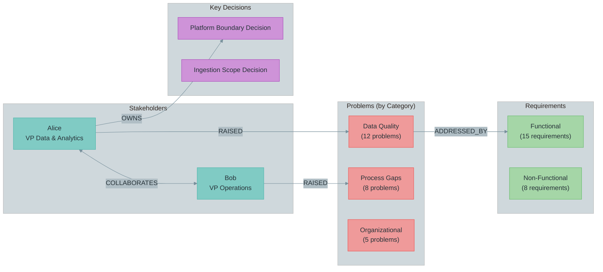

# DSRAG Knowledge Graph

A read-only synthesis skill that scans the raw knowledge base, extracts entities and relationships, and generates a Mermaid-based knowledge graph (nodes + edges) with tabular index. "Passive" skill — does not modify knowledge, can be re-run at any point to refresh. Operates on raw knowledge (not consolidation). See dsrag-visualize for consolidated knowledge visualization.

## When to Use

- **After ingestion:** Visualize how newly discovered entities connect
- **Before deliverable generation:** Identify orphaned entities (problems without stakeholders, decisions without owners)
- **During synthesis:** Understand cross-cutting relationships across transcripts and documents
- **Stakeholder mapping:** See who raised which problems, who owns which decisions

## Usage

```bash
/dsrag-kg [project-id]
```

**Parameters:**
- `project_id` (required): Project identifier (e.g., `my-project`)

## Output Location

```
working_folder/knowledge_graph/
├── index.md                  # Directory index
└── relationship_index.md     # Mermaid diagram + tabular index + orphaned entities
```

---

## Execution Process

### Step 1: Validate Project

Check:
- Project exists at `.dsrag/[project_id]/`
- Knowledge base directory exists at `.dsrag/[project_id]/knowledge/`

If project not found:
```
Error: Project '[project_id]' not found.
Initialize first: /dsrag-init-project
```

If knowledge directory exists but subdirectories are missing:
```
Warning: Knowledge subdirectory 'problems/' not found. Skipping problem extraction.
```
**Warn but continue** — partial knowledge bases are valid.

### Step 2: Extract Stakeholders

Read all individual stakeholder profiles:
```
Glob: .dsrag/[project_id]/knowledge/stakeholders/profiles/*.md
```

**Exclusion filters** — skip non-individual stakeholders:
```python
EXCLUDE_PATTERNS = [
    "team",            # data-team.md, application-team.md
    "carrier",         # carrier.md
    "account-managers" # account-managers.md
]
EXCLUDE_DIRS = ["consulting-team/"]
```

For each individual profile, extract:
- **Name** (from filename or first heading)
- **Role** (from role/title field)
- **Relationships** to other stakeholders (from relationship sections, "works with", "reports to", etc.)

Also read the stakeholder map if present:
```
Read: .dsrag/[project_id]/knowledge/stakeholders/stakeholder_map.md
```

### Step 3: Extract Problems

Read all problem files:
```
Glob: .dsrag/[project_id]/knowledge/problems/*_problems.md
```

For each problem file, extract:
- **Problem title** (from headings or problem statement labels)
- **Category** (if categorized — e.g., "Data Quality", "Process", "Organizational")
- **Severity** (if rated — Critical, High, Medium, Low)
- **Stakeholder attribution** from citation patterns:
  ```
  [Source: ..., Speaker: "Alice"]
  [Source: ..., Line: 45, Speaker: "Bob"]
  ```

### Step 4: Extract Decisions

Read all decision files:
```
Glob: .dsrag/[project_id]/knowledge/decisions/*_decisions.md
```

For each decision, extract:
- **Decision title** (from heading or "Decision:" field)
- **Who Decided** (from "Decided by:", "Owner:", or attribution fields)
- **Affected capabilities** (from "Affects:", "Impact:", or capability references)

### Step 5: Extract Requirements

Read all requirement files:
```
Glob: .dsrag/[project_id]/knowledge/requirements/*.md
```

For each requirement file, extract:
- **Requirement titles** (from headings or numbered items)
- **Problem cross-references** (from "Addresses:", "Related Problem:", or inline references)

### Step 6: Extract Value Stream Presence

Read all value stream files:
```
Glob: .dsrag/[project_id]/knowledge/value_streams/*.md
```

For each value stream file:
- Scan for **stakeholder name mentions** (match against names extracted in Step 2)
- Record which stakeholders appear in which value stream analyses
- Note the source filename (used as meeting/session identifier)

### Step 7: Build Relationship Edges

Construct relationship edges from extracted data:

| Edge Type | Direction | Source Step | Logic |
|-----------|-----------|-------------|-------|
| `RAISED` | Stakeholder → Problem | Step 3 | Speaker attribution in citations |
| `OWNS` | Stakeholder → Decision | Step 4 | "Who Decided" field |
| `COLLABORATES` | Stakeholder ↔ Stakeholder | Step 2 | Relationship sections in profiles |
| `ADDRESSED_BY` | Problem → Requirement | Step 5 | Problem cross-references in requirements |
| `ATTENDS` | Stakeholder → Meeting/VSM | Step 6 | Name mentions in value streams |

**Deduplication:** Merge duplicate edges (same source + target + type). Keep the most specific citation.

### Step 8: Generate Mermaid Diagram

Build a Mermaid `graph LR` diagram with these design rules:

1. **Group problems by category** — NOT individual nodes (200+ would be unreadable)
2. **Show individual nodes** for: stakeholders, decisions, requirement groups
3. **Use `subgraph` clustering** by entity type
4. **Muted material color palette** (consistent with C4 architecture docs)



### Step 9: Write Output

**9.1 Create output directory:**
```bash
mkdir -p working_folder/knowledge_graph/
```

**9.2 Write relationship_index.md:**

```markdown
# Knowledge Relationship Index

**Project:** [project_id] | **Generated:** [date] | **Sources:** [count] files scanned

---

## Relationship Graph

[Mermaid diagram from Step 8]

---

## Tabular Index

### Stakeholder → Problem (RAISED)

| Stakeholder | Problem | Category | Source |
|-------------|---------|----------|--------|
| Alice | Data loading takes 2+ weeks | Data Quality | [Source: ingestion-discussion.txt, Speaker: "Alice"] |
| ... | ... | ... | ... |

### Stakeholder → Decision (OWNS)

| Stakeholder | Decision | Source |
|-------------|----------|--------|
| Alice | Platform boundary includes ingestion | [Source: ingestion_scope_boundary_decision.md] |
| ... | ... | ... |

### Stakeholder ↔ Stakeholder (COLLABORATES)

| Stakeholder A | Stakeholder B | Context | Source |
|---------------|---------------|---------|--------|
| Alice | Bob | Data operations handoff | [Source: alice.md, bob.md] |
| ... | ... | ... | ... |

### Problem → Requirement (ADDRESSED_BY)

| Problem | Requirement | Source |
|---------|-------------|--------|
| Data loading bottleneck | Automated ingestion pipeline | [Source: data-flow_requirements.md] |
| ... | ... | ... |

### Stakeholder → Meeting/VSM (ATTENDS)

| Stakeholder | Session | Source |
|-------------|---------|--------|
| Alice | Ingestion Discussion | [Source: ingestion-discussion_vsm.md] |
| ... | ... | ... |

---

## Orphaned Entities

### Problems without stakeholder attribution

| Problem | Category | Source File |
|---------|----------|-------------|
| [Problems with no RAISED edge] | ... | ... |

### Decisions without owners

| Decision | Source File |
|----------|-------------|
| [Decisions with no OWNS edge] | ... |

### Stakeholders without problem attribution

| Stakeholder | Role | Note |
|-------------|------|------|
| [Stakeholders with no RAISED edges] | ... | May need follow-up interviews |

---

## Statistics

| Metric | Count |
|--------|-------|
| Stakeholders extracted | [N] |
| Problems extracted | [N] |
| Decisions extracted | [N] |
| Requirements extracted | [N] |
| Value streams scanned | [N] |
| **Total relationships** | **[N]** |
| Orphaned problems | [N] |
| Orphaned decisions | [N] |
```

**9.3 Write index.md:**

```markdown
# Knowledge Graph

**Location:** `working_folder/knowledge_graph/`

| File | Description | Updated |
|------|-------------|---------|
| `relationship_index.md` | Mermaid relationship graph + tabular index of all entity connections | [date] |
| `index.md` | This file | [date] |

## Purpose

Visualizes how entities (stakeholders, problems, decisions, requirements) connect across the knowledge base. Generated by `/dsrag-kg`. Overwrites on each re-run — git provides version history.

## Entity Types

| Type | Source | Color |
|------|--------|-------|
| Stakeholder | `knowledge/stakeholders/profiles/*.md` | Teal |
| Problem | `knowledge/problems/*_problems.md` | Red |
| Decision | `knowledge/decisions/*_decisions.md` | Purple |
| Requirement | `knowledge/requirements/*.md` | Green |

## Relationship Types

| Type | Direction | Meaning |
|------|-----------|---------|
| RAISED | Stakeholder → Problem | Stakeholder identified this problem |
| OWNS | Stakeholder → Decision | Stakeholder made/owns this decision |
| COLLABORATES | Stakeholder ↔ Stakeholder | Working relationship |
| ADDRESSED_BY | Problem → Requirement | Requirement addresses this problem |
| ATTENDS | Stakeholder → Meeting/VSM | Stakeholder present in session |
```

### Step 10: Report Completion

```markdown
## Knowledge Relationship Index Generated

**Project:** [project_id]
**Output:** `working_folder/knowledge_graph/relationship_index.md`

### Entity Counts

| Entity | Extracted | With Relationships | Orphaned |
|--------|-----------|-------------------|----------|
| Stakeholders | [N] | [N] | [N] |
| Problems | [N] (in [N] categories) | [N] | [N] |
| Decisions | [N] | [N] | [N] |
| Requirements | [N] | [N] | — |

### Relationship Counts

| Type | Count |
|------|-------|
| RAISED (Stakeholder → Problem) | [N] |
| OWNS (Stakeholder → Decision) | [N] |
| COLLABORATES (Stakeholder ↔ Stakeholder) | [N] |
| ADDRESSED_BY (Problem → Requirement) | [N] |
| ATTENDS (Stakeholder → Meeting) | [N] |
| **Total** | **[N]** |

### Orphaned Entities (Action Items)

[List orphaned problems/decisions if any — these indicate gaps in attribution]

### Next Steps
- Review orphaned entities — may indicate gaps in knowledge extraction
- Use relationship data to inform consolidation and deliverables
- Re-run after new ingestion: `/dsrag-kg [project-id]`
```

---

## Design Decisions

| Decision | Rationale |
|----------|-----------|
| **Skill, not agent template** | User-facing and self-contained — not invoked by another orchestrator |
| **Problems grouped by category** | 200+ individual problem nodes would be unreadable in Mermaid |
| **Overwrites on re-run** | Relationship graph is a point-in-time snapshot; git provides version history |
| **No infrastructure dependency** | Reads files directly — zero Docker/DB requirements |
| **Muted material palette** | Consistent with C4 architecture docs across the project |
| **Tabular index alongside diagram** | Diagram shows structure; tables show detail with citations |
| **Orphaned entity tracking** | Surfaces gaps — problems nobody raised, decisions nobody owns |

---

## Edge Cases

### Empty knowledge base
```
Warning: No knowledge files found in .dsrag/[project_id]/knowledge/
Nothing to index. Run /dsrag-ingest first.
```

### Partial knowledge base (e.g., only stakeholders)
- Generate what's available
- Note missing entity types in the report
- Relationship graph will show only available entity types

### No attributable relationships
- Generate entity lists but note "No relationships extracted"
- All entities appear in the orphaned section
- Suggest running `/dsrag-consolidate` or reviewing citation patterns

### Very large knowledge bases (50+ stakeholders)
- Stakeholder nodes in diagram may become crowded
- Consider filtering to top-N stakeholders by relationship count
- Tables will contain all entities regardless

---

## Related Skills

- `dsrag-ingest` — Upstream: populates the knowledge base that this skill indexes
- `dsrag-consolidate` — Parallel: both synthesize from knowledge, but consolidate creates reference docs while this creates relationship visualization
- `dsrag-consolidate` — Complementary: consolidation synthesizes themes, this visualizes entity relationships
- `dsrag-visualize` — Complementary: visualizes consolidated understanding, while this skill graphs raw knowledge entities
