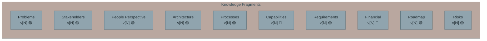
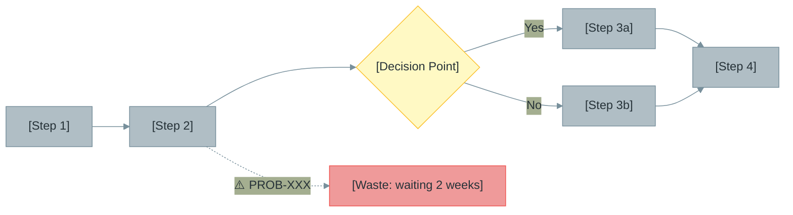
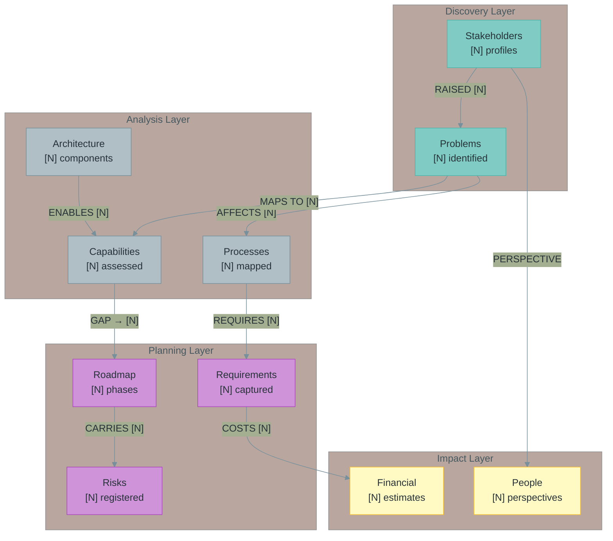

# DSRAG Visualize

Sequential visual validation of consolidated understanding. Produces three outputs from consolidation fragments, pausing for user review between each.

## When to Use

- After consolidation to validate understanding before deliverables
- To identify gaps, inconsistencies, or missing connections
- As a quality gate before `/dsrag-deliver`
- When stakeholders need visual summaries

## Prerequisites

- Project must be initialized with `dsrag-init-project`
- Consolidation must have run (`/dsrag-consolidate`)

## Usage

```bash
/dsrag-visualize [project-id]
```

**Parameters:**
- `project_id` (required): Project identifier

## Output

```
[project-id]/consolidation/visualization/
├── index.md                          # Directory index
├── overall_summary.md                # Step 1: Completeness + gaps
├── process_flow.md                   # Step 2: Process visualizations
└── cross_fragment_relationships.md   # Step 3: How fragments connect
```

Create/update/upsert: Each output is idempotent — re-running overwrites previous version. Git provides history.

---

## Execution Process

### Step 0: Validate Prerequisites

Check:
- Project exists at `.dsrag/[project_id]/`
- Consolidation directory exists at `[project-id]/consolidation/`
- At least 3 fragment files exist

If consolidation not found:
```markdown
⚠️ Consolidation required before visualization.

Run `/dsrag-consolidate [project-id]` first, then re-run this skill.

Would you like to run consolidation now?
```

If user says yes, invoke `/dsrag-consolidate [project-id]` then continue.

**Important guidance:**
```markdown
ℹ️ **Validation reminder:** Visualizations are generated from your consolidated fragments.
Review the consolidation fragments for accuracy BEFORE relying on these visuals for decisions.
Consolidation location: [project-id]/consolidation/
```

Create output directory:
```bash
mkdir -p [project-id]/consolidation/visualization/
```

---

### Step 1: Overall Summary

**Purpose:** Completeness dashboard showing what the knowledge base covers, what's missing, and confidence levels.

**Read:** All 10 consolidation fragments + `index.md` + `version_log.md`

**Write:** `[project-id]/consolidation/visualization/overall_summary.md`

**Template:**

```markdown
# Knowledge Base — Overall Summary

**Project:** [project_id]
**Generated:** [date]
**Consolidation Version:** [from version_log.md]

---

## Completeness Dashboard



## Fragment Status

| Fragment | Version | Completeness | Key Content | Gaps |
|----------|---------|-------------|-------------|------|
| Problems | v[N] | 🟢 [score] | [count] problems, [count] critical | [gaps or "None"] |
| Stakeholders | v[N] | 🟡 [score] | [count] profiles | [gaps] |
| ... | ... | ... | ... | ... |

## Key Statistics

| Metric | Count |
|--------|-------|
| Total problems identified | [N] |
| Stakeholders profiled | [N] |
| Decisions documented | [N] |
| Requirements captured | [N] |
| Value streams mapped | [N] |
| Sources processed | [N] |

## Critical Gaps

[List the most significant gaps across all fragments — things that would weaken deliverables]

1. **[Gap 1]:** [Description and which fragment is affected]
2. **[Gap 2]:** [Description]

## Recommended Actions

| Priority | Action | Addresses |
|----------|--------|-----------|
| High | [action] | [gap] |
| Medium | [action] | [gap] |
```

**After writing, report to user:**

```markdown
### Step 1 Complete: Overall Summary

**Output:** `[project-id]/consolidation/visualization/overall_summary.md`

**Highlights:**
- [count] fragments at 🟢, [count] at 🟡, [count] at 🔴
- [count] critical gaps identified
- [key finding]

Please review the summary. Ready to proceed to Step 2 (Process Flow)?
```

**Wait for user confirmation before continuing.**

---

### Step 2: Process Flow

**Purpose:** Visualize business processes, value streams, and workflows from consolidated knowledge.

**Read:** `processes.md`, `capabilities.md`, `problems.md` (for process-related problems)

**Write:** `[project-id]/consolidation/visualization/process_flow.md`

**Template:**

```markdown
# Process Flow Visualization

**Project:** [project_id]
**Generated:** [date]
**Source:** Consolidated processes, capabilities, and related problems

---

## Current State Process Map

[For each major value stream/process identified in processes.md, create a Mermaid flowchart]

### [Process Name 1]



**Pain Points in This Process:**
| Problem | Severity | Impact |
|---------|----------|--------|
| PROB-XXX | Critical | [impact] |

---

### [Process Name 2]
[Similar structure]

---

## Capability-Process Mapping

| Capability | Supporting Processes | Maturity | Gap |
|-----------|---------------------|----------|-----|
| [L1 capability] | [processes] | [level] | [gap] |

---

## Waste Summary (TIMWOODS)

| Waste Type | Occurrences | Most Critical |
|-----------|-------------|---------------|
| Waiting | [N] | [example] |
| Defects | [N] | [example] |
| ... | ... | ... |
```

**After writing, report to user:**

```markdown
### Step 2 Complete: Process Flow

**Output:** `[project-id]/consolidation/visualization/process_flow.md`

**Highlights:**
- [count] processes visualized
- [count] pain points annotated
- [count] waste instances identified

Please review the process flows. Ready to proceed to Step 3 (Cross-Fragment Relationships)?
```

**Wait for user confirmation before continuing.**

---

### Step 3: Cross-Fragment Relationships

**Purpose:** Show how the 10 consolidation fragments connect — which problems map to which capabilities, which stakeholders own which risks, etc.

**Read:** All 10 consolidation fragments, scanning for cross-references (PROB-XXX, RISK-XXX, REQ-F-XXX, etc.)

**Write:** `[project-id]/consolidation/visualization/cross_fragment_relationships.md`

**Template:**

```markdown
# Cross-Fragment Relationships

**Project:** [project_id]
**Generated:** [date]
**Source:** Cross-references across all 10 consolidation fragments

---

## Relationship Map



---

## Cross-Reference Index

### Problems → Capabilities

| Problem ID | Problem | Affected Capability | Impact |
|-----------|---------|-------------------|--------|
| PROB-XXX | [title] | [capability] | [impact] |

### Problems → Requirements

| Problem ID | Requirement ID | Requirement | Status |
|-----------|---------------|-------------|--------|
| PROB-XXX | REQ-F-XXX | [title] | [status] |

### Risks → Roadmap Phases

| Risk ID | Risk | Affected Phase | Mitigation |
|---------|------|---------------|------------|
| RISK-XXX | [title] | [phase] | [mitigation] |

### Stakeholders → Problems (Top Contributors)

| Stakeholder | Problems Raised | Critical | High |
|------------|----------------|----------|------|
| [name] | [N] | [N] | [N] |

---

## Orphaned References

[Cross-references that point to missing entities]

| Reference | Found In | Points To | Status |
|-----------|----------|-----------|--------|
| PROB-XXX | roadmap.md | problems.md | ⚠️ Not found |
| REQ-F-XXX | financial.md | requirements.md | ⚠️ Not found |

---

## Fragment Interconnection Density

| Fragment | References Out | Referenced By | Density |
|----------|---------------|---------------|---------|
| Problems | [N] | [N] | [High/Med/Low] |
| Stakeholders | [N] | [N] | [High/Med/Low] |
| ... | ... | ... | ... |

**Isolated fragments** (low interconnection — may indicate gaps):
- [fragment] — only [N] cross-references
```

**After writing, report to user:**

```markdown
### Step 3 Complete: Cross-Fragment Relationships

**Output:** `[project-id]/consolidation/visualization/cross_fragment_relationships.md`

**Highlights:**
- [count] cross-references mapped
- [count] orphaned references found
- Most connected fragment: [name] ([N] references)
- Most isolated fragment: [name] ([N] references)

All 3 visualization outputs complete.
```

---

### Step 4: Write Index and Report

**Write:** `[project-id]/consolidation/visualization/index.md`

```markdown
# Knowledge Visualization

**Project:** [project_id]
**Generated:** [date]

| File | Description | Status |
|------|-------------|--------|
| `overall_summary.md` | Completeness dashboard, gaps, statistics | Generated |
| `process_flow.md` | Current state process maps with pain points | Generated |
| `cross_fragment_relationships.md` | How fragments connect, cross-references | Generated |

## Purpose

Visual validation of consolidated understanding. Review these AFTER validating the consolidation fragments themselves.

**Validation order:**
1. Review consolidation fragments for accuracy
2. Review overall summary for completeness
3. Review process flows for correctness
4. Review cross-fragment relationships for consistency
```

**Final completion report:**

```markdown
## Visualization Complete

**Project:** [project-id]
**Output:** `[project-id]/consolidation/visualization/`

### Files Generated
| Output | Key Finding |
|--------|-------------|
| Overall Summary | [count] gaps, [score] completeness |
| Process Flow | [count] processes, [count] waste points |
| Cross-Fragment | [count] cross-refs, [count] orphans |

### Next Steps
- Address gaps identified in overall summary
- Validate process flows with stakeholders
- Resolve orphaned cross-references
- Run `/dsrag-deliver` when satisfied with knowledge quality
```

---

## Design Decisions

| Decision | Rationale |
|----------|-----------|
| Sequential with user confirmation | Heavy outputs — user needs to review each before proceeding |
| Reads from consolidation only | Consolidation is deduplicated and structured — raw KB would produce inconsistent visuals |
| Three distinct outputs | Each serves different validation purpose (completeness, process, connections) |
| Mermaid diagrams | Consistent with project convention, renderable in markdown |
| Overwrites on re-run | Visualizations are point-in-time snapshots; git provides history |

---

## Related Skills

- `dsrag-consolidate` — Prerequisite: generates the fragments this skill visualizes
- `dsrag-kg` — Complementary: `dsrag-kg` graphs raw knowledge entities, this visualizes consolidated understanding
- `dsrag-pm-update` — Complementary: PM status report alongside visual validation
- `dsrag-deliver` — Downstream: generate deliverables after visual validation
